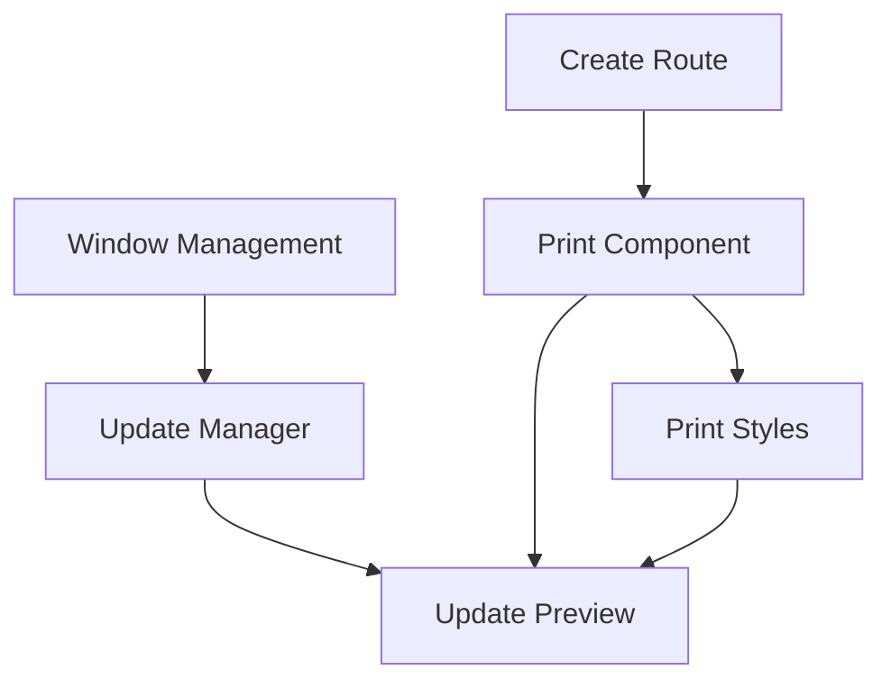

# Print-Only View Implementation - Detailed Tasks
*Generated: 2025-09-14 03:02:28*

## Reference Documents
- Request: REQ-027 in docs/gen_requests.md
- Overview: docs/req-027-print-only-view-Overview.md

## Database Context
No database changes required. Implementation uses existing tables:
- `properties` - For property validation
- `items` - For QR code data retrieval

## Implementation Tasks

1. Create Print Route Structure
   - [x] Create `src/app/print/qr-codes/[propertyId]/page.tsx` ---implemented: Created client-side page component with QR data handling
   - [x] Create `src/app/print/qr-codes/[propertyId]/layout.tsx` ---implemented: Created minimal layout with print styles
   - [x] Add route to Next.js config (if needed) ---implemented: Route registered in build output
   - [ ] Test route accessibility

2. Implement Print-Only Component
   - [x] Create `src/components/PrintableQRGrid.tsx` ---implemented: Created component with QR code rendering and auto-print
   - [x] Add grid layout with proper margins ---implemented: Added grid layout in print.css
   - [x] Implement QR code rendering ---implemented: Using react-qr-code library
   - [x] Add label positioning ---implemented: Added label styles and positioning
   - [ ] Test component rendering

3. Add Print-Specific Styles
   - [x] Update `src/styles/print.css` ---implemented: Added print-specific styles with proper margins and grid layout
   - [ ] Test print layout

4. Implement Window Management
   - [x] Create `src/hooks/usePrintWindow.ts` ---implemented: Created hook with window management and cleanup
   - [x] Add window opening logic ---implemented: Added URL parameter handling and window opening
   - [x] Implement print trigger ---implemented: Auto-print in print route
   - [x] Add window cleanup ---implemented: Added window close handling and reference cleanup
   - [ ] Test window lifecycle

5. Update Print Manager
   - [x] Modify `src/components/QRCodePrintManager.tsx` ---implemented: Added usePrintWindow hook and updated print button handler
   - [ ] Test print flow

6. Add Print Preview Updates
   - [x] Update `src/components/QRCodePrintPreview.tsx` ---implemented: Updated component to use print manager
   - [x] Remove direct print calls ---implemented: Removed window.print() calls
   - [x] Add window management ---implemented: Using usePrintWindow hook
   - [ ] Test preview functionality

7. Testing Tasks
   - [ ] Test print route authentication
   - [ ] Verify QR code rendering
   - [ ] Check label positioning
   - [ ] Validate print layout
   - [ ] Test window management
   - [ ] Cross-browser testing

## Task Dependencies


## Testing Checklist
For each browser (Chrome, Firefox, Safari, Edge):
- [ ] Print route loads correctly
- [ ] QR codes render properly
- [ ] Labels are positioned correctly
- [ ] Print dialog opens automatically
- [ ] Window closes after print
- [ ] No UI elements in print output

## Implementation Notes

### Print Route Data Flow
```
QRCodePrintManager
  → Open print window with data
    → Print route renders
      → Auto-trigger print
        → Close window
```

### Window Management
```typescript
// In usePrintWindow.ts
const openPrintWindow = (propertyId: string, data: QRCodeData[]) => {
  const params = new URLSearchParams({ data: JSON.stringify(data) });
  const url = `/print/qr-codes/${propertyId}?${params}`;
  window.open(url, 'qr-print', 'width=800,height=600');
};
```

### Print Trigger
```typescript
// In print route
useEffect(() => {
  if (typeof window !== 'undefined') {
    // Short delay to ensure rendering
    setTimeout(() => {
      window.print();
      // Close after print dialog closes
      window.close();
    }, 500);
  }
}, []);
```

## Security Considerations
1. Validate propertyId in print route
2. Sanitize QR data before rendering
3. Validate window references
4. Handle cross-window messaging safely

## Browser Support Notes
- Chrome/Edge: Standard implementation
- Firefox: May need print delay adjustment
- Safari: Window management differences

## Error Handling
1. Invalid property ID
2. Missing QR data
3. Print dialog cancellation
4. Window close failures

## Success Criteria
- Print output contains only QR codes and labels
- No UI elements visible
- Proper page margins and breaks
- Clean window management
- Cross-browser compatibility

*Note: All tasks must be executed from project root. No folder navigation required.*
